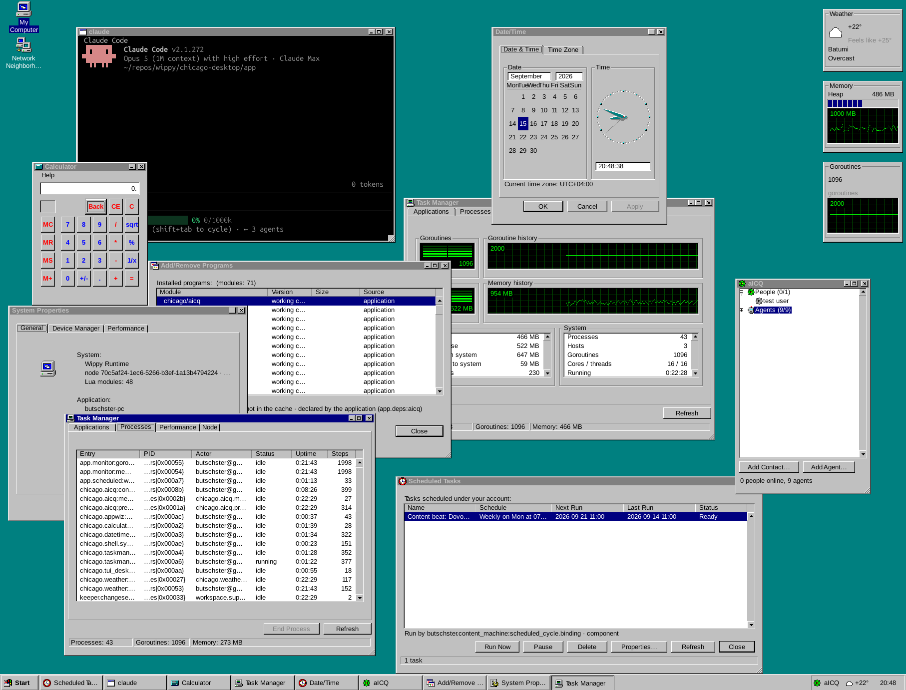

# Chicago

A desktop in the terminal, in the look of the mid-nineties desktops, served from a server over SSH.



**Installing on a server:** see [INSTALLATION.md](INSTALLATION.md) — the
step-by-step guide from an empty account to a desktop over SSH, with a
systemd unit, the ports, updating, backups and troubleshooting.

`ssh -t -p 2222 <server>` gets you the logon dialog, then a teal desktop
with a taskbar, a Start menu, overlapping windows, real programs under a PTY
(a bash, htop, an editor), the games and the apps — and the same platform's
agents, models and MCP behind them. Every connection is a desktop of its own,
under the account that logged on. The same application serves the web
platform (users, agents, models, sessions, MCP) on `127.0.0.1:8099`.

This repository is the *application*: it composes modules (the platform's from the Hub, the desktop's resolved from their GitHub repositories by tag — v0.2.0 is the first) and adds what
only an application can declare — the logon, the SSH host, the users'
SSH keys and the MCP window workshop. The platform's system windows (Users
with User Profile, Services, Scheduled Tasks, Event Viewer, Connections) are
modules like the rest, and the runtime monitor widgets come with Task
Manager.

## What it composes

| Module | Source | What it is |
|---|---|---|
| `kickside/kickside`, `kickside/mcp` | the Hub | the platform: users, agents, models, sessions, MCP |
| `chicago/tui-desktop` | GitHub by tag: [chicago-desktop/tui-desktop](https://github.com/chicago-desktop/tui-desktop) | the terminal window manager: compositor, PTY windows, the command channel |
| `chicago/shell` | GitHub by tag: [chicago-desktop/shell](https://github.com/chicago-desktop/shell) | the Chicago shell: theme, Start menu, the SDK windows are written against |
| `chicago/minesweeper` | GitHub by tag: [chicago-desktop/minesweeper](https://github.com/chicago-desktop/minesweeper) | Minesweeper |
| `chicago/weather` | GitHub by tag: [chicago-desktop/weather](https://github.com/chicago-desktop/weather) | Weather: window, tray, desktop widget |
| `chicago/aicq` | GitHub by tag: [chicago-desktop/aicq](https://github.com/chicago-desktop/aicq) | aICQ: people and agents in one contact list |
| the runtime | release binary: [chicago-desktop/runtime](https://github.com/chicago-desktop/runtime) | the fork of wippyai/runtime the shell needs (see below) |

The declarations live in `src/app/deps/_index.yaml`; the shell's
"Add/Remove Programs" edits that file. A desktop module's entry names its
repository (`component: github.com/chicago-desktop/<name>`) and a version
range over the repository's semver tags (`>=0.2.0`); the runtime's git
sources resolve the tag to a commit, and `wippy.lock` records the commit
(`source`, `commit`, `local_hash`). The platform's entries name Hub modules
(`kickside/kickside`) and the lock records their Hub versions and hashes.
The other desktop modules in that file (Calculator, Network Neighborhood,
AntiBug, Add/Remove Programs, Registry Editor, Date/Time, Task Manager with
the monitor widgets, Run…, and the platform's system windows — Users with
User Profile, Services, Scheduled Tasks, Event Viewer, Connections) come the
same way, each from its own repository in
[chicago-desktop](https://github.com/chicago-desktop).

## Requirements

- **The runtime fork** — [chicago-desktop/runtime](https://github.com/chicago-desktop/runtime),
  branch `wippy-projects`. The shell needs its `gfx` module (pixels in the
  terminal) and its `terminal.ssh` host, and the application needs its git
  sources — the desktop's modules are resolved from their GitHub
  repositories by tag, which a release `wippy` cannot do; nor does it have
  `gfx` or `terminal.ssh`, and an entry that declares a module the runtime
  does not know fails the whole boot, not just that entry. `make runtime`
  downloads the fork's latest
  [release](https://github.com/chicago-desktop/runtime/releases) binary for
  this machine into `bin/wippy` (`v0.3.40a-chicago.4` today; Linux and
  macOS, amd64 and arm64; `RUNTIME_TAG=v0.3.40a-chicago.4` pins a version);
  or build it there with `make build-wippy-local` and point `WIPPY` at the
  binary.
- **git on PATH** — the runtime clones the desktop's modules with the
  system `git` (into `~/.wippy/git`, `WIPPY_GIT_CACHE` overrides); a missing
  git is one clear error naming the source. Network is needed once, for
  `wippy install` on a fresh checkout; later boots work from the cache.
- No font package: the shell carries its own fonts (Liberation Sans and
  Mono, under the SIL Open Font License, in the module's `assets/fonts`) and
  reads them from `chicago.shell.theme:fonts` unless `CHICAGO_FONTS` names
  another filesystem.
- A terminal with kitty or sixel graphics for the pixel theme (kitty,
  WezTerm, foot, the terminals that speak sixel …). Any terminal works in
  cell mode.

## First boot

```bash
make runtime                                    # the runtime fork's release binary into bin/wippy
./bin/wippy install                             # modules from the committed wippy.lock
export KICKSIDE_USERS_DEFAULT_ADMIN_EMAIL=admin@example.com
export KICKSIDE_USERS_DEFAULT_ADMIN_PASSWORD='choose one'
./bin/wippy run
```

The two variables are read from the OS environment of the process and create
the first administrator on the first start; the encryption key is generated
into `.wippy/.env` and the SSH host key into `.wippy/ssh_host_ed25519_key`.
What each step prints, the first-boot quirks and the service unit:
[INSTALLATION.md](INSTALLATION.md).

## Running

```bash
./bin/wippy run                                       # the web platform on 127.0.0.1:8099 and the SSH desktop on :2222
ssh -t -p 2222 <server>                               # from anywhere: the logon dialog, then the desktop
./bin/wippy run --host chicago.shell:terminal chicago # the desktop in this terminal (the whole runtime comes up with it)
```

The SSH door asks nothing itself (`auth: logon`): the logon dialog checks the
account's name and password, the same as the web logon; a public key pasted
in Start → Settings → SSH Keys logs its owner on without the password screen;
at most 10 failed logons per user name. Ports, tunnels, stopping, updating
and backups: [INSTALLATION.md](INSTALLATION.md).

`--host` is required for every command that names one: the desktop modules
bring terminal hosts of their own, and the CLI refuses to pick one when it
sees several. Only one instance can run: a second one cannot bind :8099 and
dies quietly while the first keeps serving. Stopping takes about twenty
seconds.

## Tests

```bash
wippy test --host wippy.terminal:host
```

This boots the whole application (the modules' migrations included), so run
it only when the application may come up. The tests are the `*_test.lua`
files next to the code, each with a `meta.type: test` entry.

## Updating

```bash
wippy update            # re-resolves src/app/deps against the GitHub tags and the Hub, rewrites wippy.lock
```

For a desktop module `wippy update` lists the repository's tags
(`git ls-remote --tags`), picks the highest one in the entry's range,
resolves it to a commit and writes `source`, `commit` and `local_hash` into
the lock; for the platform modules it asks the Hub as before. `wippy
install` and the boot take the commit from the lock and never look at the
tags again — a moved tag is followed only by the next `update`, and a
module's fix is a new tag. Back up `wippy.lock` before running it against a
working system: a dependency the resolve drops is a boot that fails. The
lock is committed; commit it with the change that moved it.

## For agents

Skills in `.claude/skills/` (one `SKILL.md` each):

- `wippy-window-app` — write or repair a window on the shell's SDK (registry entry, component tree, resize, scrolling, input, lifecycle); `docs/sdk.md` is the application's copy of the shell's SDK guide.
- `wippy-window-workshop` — build a window in the running runtime through the ChicagoWorkshop MCP tool (`app.workshop:chicago_workshop`) or `POST /api/v1/tui-desktop/apps`, no files, no restart.
- `tui-desktop` — drive a live desktop through its command channel: open a window, type into it, read its screen, move or close it.
- `chicago-debug` — see what the desktop is doing, the SSH desktop, the terminal probe, the log, restarts, live update, tests and lint, and the traps that fail silently.
- `chicago-add-module` — add a module from its GitHub repository to the application (by tag, through the runtime's git sources), move one to a newer tag, pin a branch or commit for development, or write a new one from `chicago/module-template` and release it by pushing a tag.

Tools in `tools/`:

- `tui-probe.py` — a PTY probe: runs a command (the shell, or `ssh -tt -p 2222 localhost`), types by a script, prints the screen as text.
- `live-update.sh <namespace> [migration …]` — pushes `src/` of one `app.*` namespace into the running registry through keeper's sync (upload only) and runs migrations.
- `late-locals.py` — finds file-level locals read above their declaration.

## The icons

The icon set ships with the shell module (`chicago/shell`,
`assets/icons`, see its `SOURCE.md`); the application carries none of its
own. The icon set is an interim one and is being replaced with original pixel art
([chicago-desktop/shell#1](https://github.com/chicago-desktop/shell/issues/1));
the code is MIT (`LICENSE`).

## Display and 3D Pipes preview

[Display](https://github.com/chicago-desktop/display) is installed as an independent
module from its GitHub tag. After restarting the desktop, right-click empty
space and choose **Properties → Screen Saver → 3D Pipes → Preview**. The same
settings window is under **Start → Settings → Display Properties**.

The Screen Saver page uses the classic monitor, Screen saver and Monitor power
groups. **Settings…** opens per-user Pipes preferences: speed, thickness and palette.
Wait, resume locking and Power controls are disabled until those features exist.

The preview fills the whole terminal with perspective pipes and rounded elbows,
without a frame or taskbar. Move the mouse or press any key to return to Display.
It follows terminal resizing and does not activate on idle. Pixel graphics are required.
Appearance settings keep using the existing shell settings repository. Modules
can add desktop menu items through `meta.type: chicago.desktop_menu` and render
inline PNGs through the shell SDK without adding per-app imports to shell.

## Floppy Setup Wizard

Open **My Computer → 3½ Floppy (A:)**, select **Ski** under **Included disks**, then click **Insert Disk → Setup…**.
The wizard has a destination page, simulated file copying, a ten-second pause
at 99%, and the classic completion screen. **Finish** returns to the drive;
no computer or desktop restart occurs. Select the program and click **Run**.

The destination and copying are presentation only. WAPP registration is real
and temporary: ejecting the disk closes its windows and removes its programs.
Cancel during copying leaves the disk inserted without registering its programs.

The disk includes **Ski**, an original SkiFree-inspired downhill game. Press
**Space** to start or pause, **← / →** to steer, and **R** for a new run.
The game opens full-screen; **Esc** returns to the drive. Avoid
trees and rocks; you have three lives. Pixel graphics are required. The older
`hello.wapp` sample remains available.

Add your own `.wapp` files to the application's `.wippy/floppy/` folder, then
choose **My disks → Refresh**. If Wippy runs on a server, copy the files there.
The **Add Disks…** button explains this inside the application.

Floppy 0.4.0 requires Shell 0.3.4 and tui-desktop 0.2.4 or newer.
Restart the desktop after updating modules to load the new SDK and disk.
